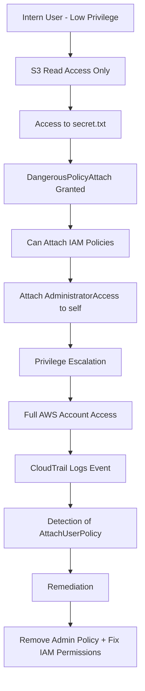

# AWS IAM Hardening Lab

## Overview

This project demonstrates AWS IAM security concepts including:

- Least Privilege Access
- IAM Misconfiguration
- Privilege Escalation
- Remediation
- CloudTrail Auditing

The lab was built entirely in AWS Free Tier using IAM, S3 and CloudTrail.

---

# Objectives

- Create a low-privileged IAM user
- Restrict access using least privilege principles
- Demonstrate privilege escalation caused by dangerous IAM permissions
- Detect actions using CloudTrail
- Remediate the vulnerability

---

# Technologies Used

- AWS IAM
- AWS S3
- AWS CloudTrail
- AWS Management Console

---

# Architecture

## Users

### admin-user
Administrator account used to manage IAM resources.

### intern-user
Low-privileged user with limited S3 read-only access.

---

# Part 1 — Least Privilege

A custom IAM policy named:

```text
InternS3ReadOnly
```

was created to allow the intern-user to:

- List the S3 bucket
- Read objects inside the bucket
- Deny access to other AWS services

The user was able to read `secret.txt` from S3.

Before privilege escalation, the intern-user received `Access Denied` when attempting to access:

- IAM users
- EC2 services

This demonstrated proper least privilege enforcement.

---

# Part 2 — Privilege Escalation

A dangerous IAM policy named:

```text
DangerousPolicyAttach
```

was intentionally attached to the low-privileged user.

The policy allowed dangerous IAM actions including:

- iam:AttachUserPolicy
- iam:ListPolicies
- iam:GetUser
- iam:ListUsers
- iam:ListAccessKeys

Using these permissions, the intern-user was able to attach:

```text
AdministratorAccess
```

to itself, resulting in a successful privilege escalation.

After the escalation, the low-privileged user gained administrative access to AWS resources including:

- IAM users and policies
- EC2 service access
- Administrative permissions across the AWS account

---

# Part 3 — CloudTrail Monitoring

CloudTrail was used to monitor IAM activity.

The following events were captured:

- AttachUserPolicy
- DetachUserPolicy

CloudTrail logs confirmed that the intern-user attached the AdministratorAccess policy and later removed it during remediation.

---

# Part 4 — Remediation

The remediation process included:

- Removing AdministratorAccess
- Removing DangerousPolicyAttach
- Restoring least privilege access

After remediation, the intern-user no longer had administrative access.

---

# Screenshots

The `/screenshots` directory contains evidence of:

- Least privilege configuration
- Access denied events
- Dangerous IAM policy configuration
- Privilege escalation
- CloudTrail event logging
- Remediation steps

---

# Security Concepts Demonstrated

- Principle of Least Privilege
- IAM Hardening
- Privilege Escalation
- Cloud Security Monitoring
- Identity and Access Management
- AWS Security Best Practices
- CloudTrail Auditing

---

# Disclaimer

This project was created in a personal AWS Free Tier lab environment for educational and portfolio purposes only.


